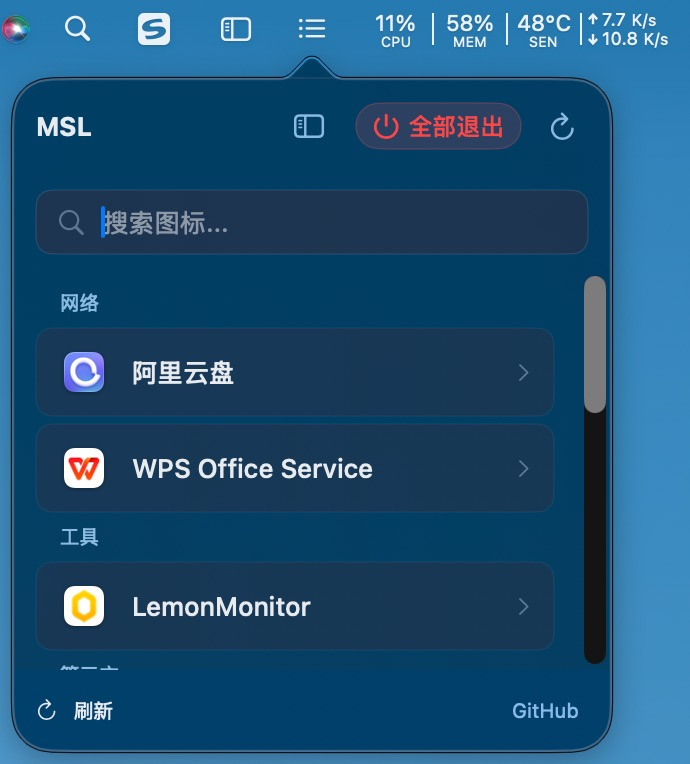
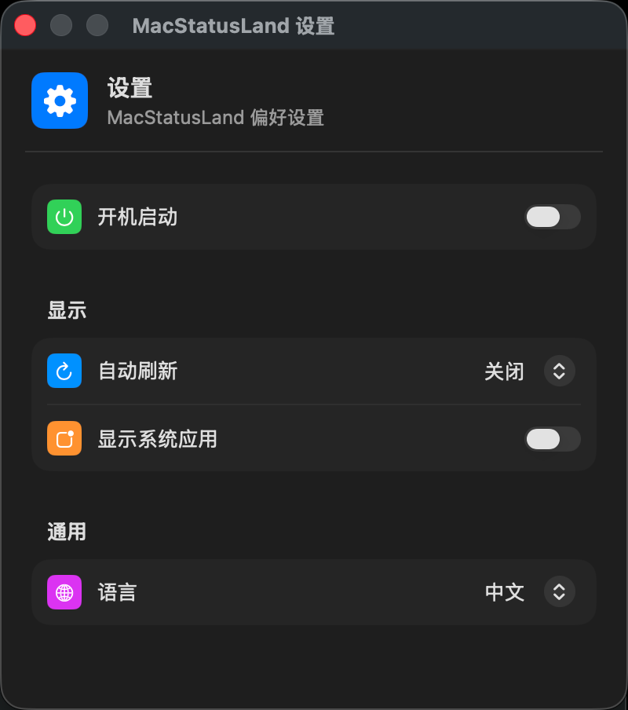

# Mac Status Land

<p align="center">
  
</p>

<p align="center">
  
  
  
  
</p>

<p align="center">
  <strong>一个 macOS 菜单栏应用，用于管理被刘海屏遮挡的状态栏图标</strong>
</p>

---

## ✨ 功能特点

- 🔍 **自动发现** — 自动扫描第三方应用的状态栏图标
- 🖱️ **一键触发** — 点击图标直接打开原应用界面
- 🪄 **一键隐藏左侧图标** — 菜单栏新增「分界」图标，点击即可挤压其左侧所有图标（Ice 风）
- 🎯 **精准识别** — 显示应用图标和名称
- ⚙️ **丰富设置** — 开机启动、自动刷新、中英文切换
- 🌙 **深色模式** — 完美支持 macOS 深色/浅色模式

## 📸 界面预览

<p align="center">
  
  &nbsp;&nbsp;&nbsp;&nbsp;
  
</p>

## 🚀 快速开始

### 系统要求

| 要求 | 版本 |
|------|------|
| macOS | 13.0 (Ventura) 或更高 |

### 安装

#### 方式一：Homebrew（推荐）

```bash
brew install xiaoRui278/tap/macstatusland
```

#### 方式二：下载 DMG

1. 前往 [Releases](https://github.com/xiaoRui278/mac-status-land/releases) 下载最新版本
2. 打开 DMG，将 MacStatusLand.app 拖到 Applications
3. 首次运行需要在 **系统设置 → 隐私与安全性 → 辅助功能** 中授权

#### 方式三：从源码编译

```bash
git clone git@github.com:xiaoRui278/mac-status-land.git
cd mac-status-land/MacStatusLand
swift run
```

### 权限设置

首次运行时，应用会请求以下权限：

| 权限 | 用途 | 必需 |
|------|------|------|
| 辅助功能 | 读取和触发状态栏图标点击 | ✅ |

> 💡 **提示**：请在 **系统设置 → 隐私与安全性 → 辅助功能** 中授权。

### ⚠️ 更新后需要重新授权

由于 macOS 安全机制，每次更新应用后，辅助功能权限会失效。这是 macOS 的正常行为，不是应用 Bug。

**重新授权步骤**：
1. 打开 **系统设置 → 隐私与安全性 → 辅助功能**
2. **删除**列表中的 MacStatusLand 条目
3. **重新打开** MacStatusLand 应用
4. 在弹出的权限请求中点击 **打开系统设置**
5. **重新勾选** MacStatusLand

> 💡 **为什么需要这样做？**
> macOS 将辅助功能权限绑定到应用的代码签名。由于 MacStatusLand 是开源项目，使用临时签名（ad-hoc），每次更新后签名会变化，导致权限失效。这是 macOS 保护用户安全的机制。

## 📖 使用方法

启动应用后，菜单栏会出现 **两个图标**，分别承担不同职责：

| 图标 | 位置 | 作用 |
|------|------|------|
| `☰`（list.bullet） | 主图标 | **打开 MacStatusLand 弹窗**，管理被刘海遮挡的图标 |
| `▮`（sidebar.left） | 分界图标（在主图标左侧） | **一键隐藏 / 恢复其左侧的所有状态栏图标**，用于腾出被刘海占用的空间 |

### 主图标 `☰`
- **左键点击** — 显示弹窗，列出所有第三方应用图标；点击某个图标即触发对应应用的原状态栏动作
- **右键点击** — 显示菜单（设置、退出）
- 弹窗顶部右侧有一个「侧栏」快捷开关，可直接切换隐藏 / 显示左侧图标

### 分界图标 `▮`（侧栏图标）
- **左键点击** — 切换「隐藏左侧图标」状态
  - 开启后：图标本身撑到超宽，把它左侧的所有菜单栏图标挤出屏幕（借鉴 [Ice](https://github.com/jordanbaird/Ice) 思路）
  - 关闭后：恢复为一个正常大小的图标，被挤走的图标重新出现
- **按住 `⌘ Command` 拖动** — 调整分界位置（系统会持久化你的位置）
- 首次启动会在图标下方弹出一次性引导气泡，说明用途

> 💡 **典型玩法**：把「分界图标」拖到你希望保留可见的最左侧图标之后，之后点一下即可把左侧不常用的图标折叠掉；再点一下恢复。

### 🎯 不同类型 app 的点击行为

在弹窗中点击应用图标时，MacStatusLand 会自动选择合适的方式召唤该 app：

| app 类型 | 举例 | 触发方式 |
|---------|------|---------|
| 有可见主窗口的普通 app | 微信、iCopy | 激活进程 + 抬起所有窗口 |
| 纯菜单栏 app（无主窗口） | 阿里云盘、TopSAP | `NSWorkspace.openApplication` 拉起主窗口 |
| 菜单栏 popover 类 app | Docker Desktop、WPS Office Service | 触发原图标的 AXPress，弹出 app 自带 popover |
| Helper / 登录项启动的 app | Docker（`Docker.app/Contents/MacOS/Docker Desktop.app`） | 向上查找主 `.app`，`openApplication` + reopen Apple Event |

> 💡 **隐藏状态下点击 popover 类 app**：MacStatusLand 会自动"临时抬起"分界图标，让被挤出屏幕的原图标短暂恢复可见（约 1.5 秒），触发其 popover 后再恢复隐藏。所以在隐藏模式下点 Docker 也能正常弹出 popover。

### ⚠️ 重要提示

**请把主图标 `☰` 保持在「分界图标 ▮」的右侧。** 否则开启隐藏时，主图标也会被一起挤出屏幕，你就只能通过重启应用来恢复。

同时**建议将主图标 `☰` 拖动到菜单栏最右侧**，避免应用自身被刘海遮挡。

> 操作方法：按住 `⌘ Command`，拖动图标到目标位置。

## ⚙️ 设置功能

右键点击状态栏图标 → 设置，可以配置：

| 设置项 | 说明 |
|--------|------|
| 开机启动 | 登录时自动启动应用 |
| 自动刷新 | 定时刷新图标列表（15/30/60/120 秒） |
| 显示系统应用 | 是否显示 Apple 系统应用图标 |
| 失焦自动关闭 | 切换应用时自动关闭 Popover |
| 全局快捷键 | 配置快捷键切换 Popover |
| 语言 | 切换中文/英文界面 |

## 🏗️ 技术架构

```
MacStatusLand/
├── Services/
│   ├── AccessibilityService.swift    # Accessibility API 封装
│   ├── IconDiscoveryService.swift    # 图标发现服务
│   ├── SettingsService.swift         # 设置服务
│   └── StringLocalization.swift      # 本地化支持
├── Views/
│   ├── MenuBarPopoverView.swift      # Popover 界面
│   └── SettingsView.swift            # 设置界面
├── StatusBarController.swift         # 状态栏控制器
└── MacStatusLandApp.swift            # 应用入口
```

### 技术栈

| 技术 | 用途 |
|------|------|
| Swift / SwiftUI | 主要开发语言和 UI 框架 |
| AppKit | macOS 原生组件 |
| Accessibility API | 读取状态栏图标信息 |
| AXUIElementPerformAction | 触发图标点击事件 |

### 工作原理

1. **发现图标** — 使用 Accessibility API 扫描 `AXExtrasMenuBar` 获取所有状态栏图标
2. **获取信息** — 读取每个图标的 `AXTitle`、`AXDescription`、`AXIdentifier`
3. **显示图标** — 优先使用应用图标，SF Symbol 作为备选
4. **触发点击** — 使用 `AXUIElementPerformAction(kAXPressAction)` 直接触发原图标动作

## 📝 更新日志

### v2.2.1 (2026-07-31)
- 🐛 修复"全部退出"点击后主线程黑屏：forceTerminate 改为异步 + 后台 detached 执行，主线程不再被 LaunchServices IPC 阻塞
- 🐛 修复"全部退出"二次确认弹窗在窄 popover 中样式丑陋：改用 inline 5s 倒计时确认条 + 倒计时环，替代系统 alert
- ✨ 全部退出期间按钮位置显示进度条（"正在退出 3/10"），用户可见进度
- ✨ 分类 header 加 SF Symbol 图标 + 颜色 + 计数（网络/媒体/工具/系统/第三方五类）
- ✨ 图标行按压反馈（scale 0.97 spring 动画）
- ✨ 图标行 chevron 仅 hover 时出现，列表更安静
- ✨ 头部加设置齿轮入口（免去右键菜单）
- ✨ popover 加宽 300→340，app 名/分类不再截断
- ✨ 搜索无匹配时显示专门空态（带"清空搜索"按钮）
- ✨ 头部 logo 用 AppIcon.icns 替代 SF Symbol
- 🧹 删 footer 重复的 refresh 按钮（header 已有）
- 🧹 `AppIcon.icns` 复制到 `Resources/`，spm run 下 header 也能显示正确 app icon（CI release 流程源文件路径不变）

### v2.2.0 (2026-07-24)
- ✨ 新增 **分界图标 `▮`**（借鉴 [Ice](https://github.com/jordanbaird/Ice)）：点击一键隐藏 / 恢复其左侧所有菜单栏图标，兼容刘海屏
- ✨ 分界图标可 `⌘ Command` 拖动调整分界位置；首次启动弹出引导气泡
- ✨ 弹窗顶部新增侧栏切换按钮，快速开关隐藏
- ✨ 设置页新增「关于菜单栏图标」区块，图文说明两枚图标职责及顺序注意事项
- ✨ 主图标改为 `list.bullet`（列表样式），语义更贴切；弹窗标题缩为 MSL
- 🐛 修复纯菜单栏 app（阿里云盘 / TopSAP 等）点击无反应
- 🐛 修复 Docker Desktop / WPS Office Service 等 popover-only app 的主界面/popover 召唤逻辑（改用 `NSWorkspace.openApplication` + reopen Apple Event）
- 🐛 隐藏状态下点击 popover 类 app 时，自动临时抬起分界让原图标就位后再触发

### v2.1.0 (2026-07-17)
- ✨ 图标右键菜单新增 **退出 / 强制退出**
- ✨ Popover 顶部新增 **全部退出** 按钮（带二次确认）
- 🐛 修复本地化在 `swift run` 与 `.app` 打包两种场景下的加载差异
- 🐛 修复图标关联进程识别错误（`IconItem` 现同时记录真实 bundle ID 与 PID）
- 🤖 引入 GitHub Actions 自动打包与发版流程

### v2.0.0 (2026-06-02)
- ✨ Liquid Glass UI 改版
- ✨ 图标分组、置顶、隐藏、搜索
- ✨ 全局快捷键
- ✨ 失焦自动关闭 Popover
- ✨ 中英文语言切换

### v1.0.0 (2025-06-01)
- ✅ 初始发布
- ✅ 支持第三方应用图标发现和点击
- ✅ 支持设置功能（开机启动、自动刷新、语言切换）
- ✅ 支持 macOS 深色模式
- ✅ 使用 Accessibility API 直接触发点击

## 📄 许可证

MIT License © [xiaoRui278](https://github.com/xiaoRui278)

---

<p align="center">
  <sub>Made with ❤️ and AI (Vibe Coding)</sub>
</p>
